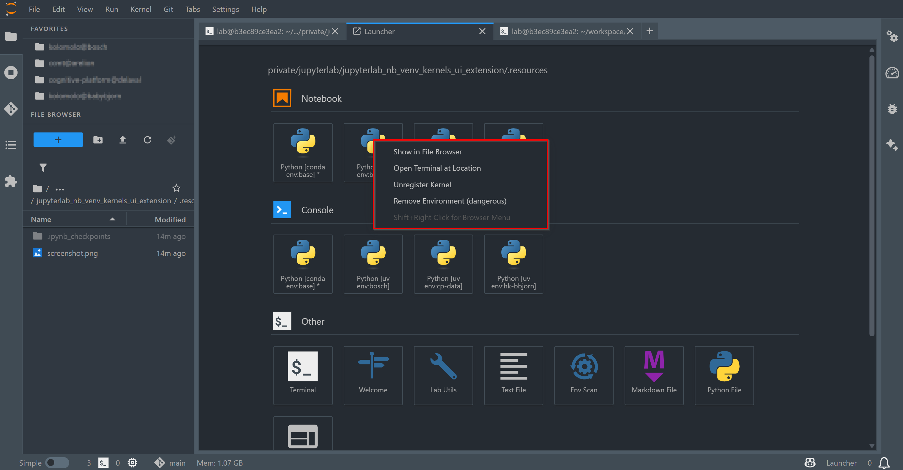

# jupyterlab_nb_venv_kernels_ui_extension

[](https://github.com/stellarshenson/jupyterlab_nb_venv_kernels_ui_extension/actions/workflows/build.yml)
[](https://www.npmjs.com/package/jupyterlab_nb_venv_kernels_ui_extension)
[](https://pypi.org/project/jupyterlab-nb-venv-kernels-ui-extension/)
[](https://pepy.tech/project/jupyterlab-nb-venv-kernels-ui-extension)
[](https://jupyterlab.readthedocs.io/en/stable/)
[](https://kolomolo.com)
[](https://www.paypal.com/donate/?hosted_button_id=B4KPBJDLLXTSA)

> [!IMPORTANT]
> **Package Renamed**: This package was renamed from `jupyterlab_launcher_navigate_to_kernel_extension` to `jupyterlab_nb_venv_kernels_ui_extension` in version 1.2.8. If you have the old package installed, please uninstall it first: `pip uninstall jupyterlab-launcher-navigate-to-kernel-extension`

Context menu extension for kernel launcher cards. Right-click on any kernel to navigate to its project directory, open a terminal, or manage the virtual environment. Intended to complement [nb_venv_kernels](https://github.com/stellarshenson/nb_venv_kernels) for workspace management.



## Features

**Context Menu (right-click on kernel launcher card)**:
- **Show in File Browser** - Navigate to the kernel's project root
- **Open Terminal at Location** - Open terminal at the kernel's project directory
- **Unregister Kernel** - Remove kernel from registry (requires [nb_venv_kernels](https://github.com/stellarshenson/nb_venv_kernels))
- **Remove Environment (dangerous)** - Permanently delete local `.venv` environments with confirmation (requires [nb_venv_kernels](https://github.com/stellarshenson/nb_venv_kernels))

**General**:
- **Project-aware navigation** - For `.venv` environments, navigates to project root (one level up from `.venv`)
- **Dynamic kernel support** - Works with `nb_conda_kernels` and `nb_venv_kernels` providers

## Requirements

- JupyterLab >= 4.0.0

## Install

```bash
pip install jupyterlab-nb-venv-kernels-ui-extension
```

## Uninstall

```bash
pip uninstall jupyterlab_nb_venv_kernels_ui_extension
```
