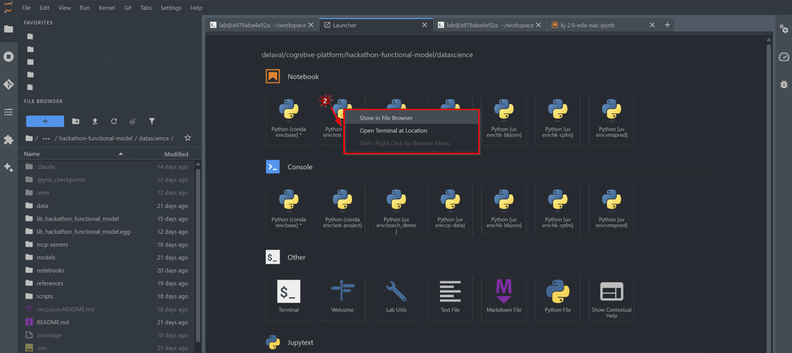

# jupyterlab_launcher_navigate_to_kernel_extension

[](https://github.com/stellarshenson/jupyterlab_launcher_navigate_to_kernel_extension/actions/workflows/build.yml)
[](https://www.npmjs.com/package/jupyterlab_launcher_navigate_to_kernel_extension)
[](https://pypi.org/project/jupyterlab-launcher-navigate-to-kernel-extension/)
[](https://pepy.tech/project/jupyterlab-launcher-navigate-to-kernel-extension)
[](https://jupyterlab.readthedocs.io/en/stable/)
[](https://kolomolo.com)
[](https://www.paypal.com/donate/?hosted_button_id=B4KPBJDLLXTSA)

Right-click on any kernel launcher card to navigate to its project directory or open a terminal there. Intended to help navigate around a busy workspace with many projects. Similar to [jupyterlab_terminal_show_in_file_browser_extension](https://github.com/stellarshenson/jupyterlab_terminal_show_in_file_browser_extension).



## Features

- **Show in File Browser** - Navigate to the kernel's project root
- **Open Terminal at Location** - Open terminal at the kernel's project directory
- **Unregister Kernel** - Remove kernel from `nb_venv_kernels` registry (requires `nb_venv_kernels`)
- **Remove Environment** - Permanently delete local `.venv` environments with confirmation (requires `nb_venv_kernels`)
- **Project-aware navigation** - For `.venv` environments, navigates to project root (one level up from `.venv`)
- **Dynamic kernel support** - Works with `nb_conda_kernels` and `nb_venv_kernels` providers

## Requirements

- JupyterLab >= 4.0.0

## Install

```bash
pip install jupyterlab-launcher-navigate-to-kernel-extension
```

## Uninstall

```bash
pip uninstall jupyterlab_launcher_navigate_to_kernel_extension
```
